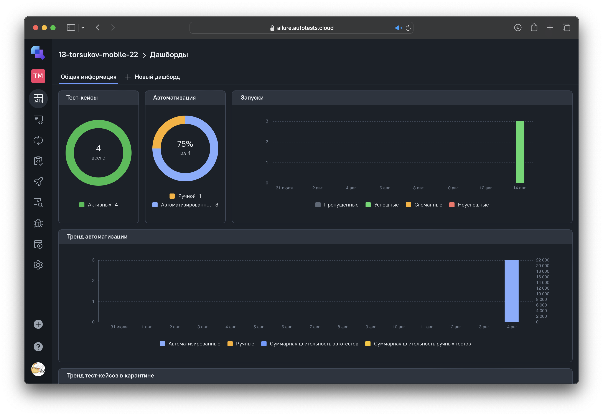
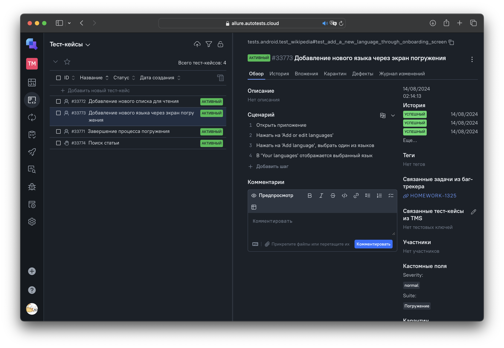

<p align="center">
  <a href="https://demoblaze.com">
  <picture>

    </picture>
  </a>
</p>
<h1 align="center">
  Wikipedia mobile tests
</h1>
<p align="center">
Тест-кейсы для общедоступной интернет-энциклопедии со свободным контентом
</p>

<p align="center">
 
  
 
 
 
 
 
 
 
 
 
 
 
 
 

</p>

## Запуск

1. Склонировать репозиторий:

```
git clone https://github.com/lrayne/demoblaze-tests.git
```

2. Установить зависимости:

```
poetry install
```

3. Открыть проект в PyCharm, настроить интерпретатор

4. Скопировать содержимое из `config.*.env.example` в `config.*.env`, где `*` — `local` или `remote`
5. Поместить `config.*.env` в корень проекта
6. При необходимости изменить значения у параметров в `config.*.env`
7. Запустить тест-кейсы, исходя из выбранного контекста:

```
context='local' pytest tests
```

```
context='remote' pytest tests
```

8. Cгенерировать отчёт:

```
allure serve allure-results
```

##  Jenkins

[](https://jenkins.autotests.cloud/job/demoblaze-tests/)

### Параметры сборки:

- `TEST_SUITE` — тестовый набор
- `DRIVER_NAME` — наименование браузера
- `DRIVER_VERSION` — версия браузера
- `WINDOW_WIDTH` и `WINDOW_HEIGHT` — разрешение окна
- `TIMEOUT` — максимальное время ожидания элемента
- `ENVIRONMENT` — окружение, `COMMENT` — комментарий. Будут отображаться в уведомлении telegram'а

<details><summary>Результат выполнения</summary>
<br>
<details><summary>Общая информация</summary>
<br>

</details>
<details><summary>Тест-кейсы</summary>
<br>

</details>
<details><summary>Видео прохождения тест-кейса</summary>
<br>

<p></p>
</details>
<details><summary>Уведомление в telegram</summary>
<br>

</details>
</details>

##  Allure TestOps

[](https://allure.autotests.cloud/project/4370/dashboards)


<details><summary>Общая информация</summary>
<br>

</details>

<details><summary>Тест-кейсы</summary>
<br>

</details>

<details><summary>История запусков</summary>
<br>

</details>

##   Jira

[](https://https://jira.autotests.cloud/browse/HOMEWORK-1318
)

<details><summary>Тест-кейсы</summary>
<br>

</details>

<details><summary>История запусков</summary>
<br>

</details>
